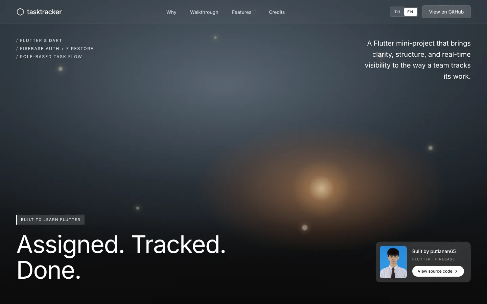
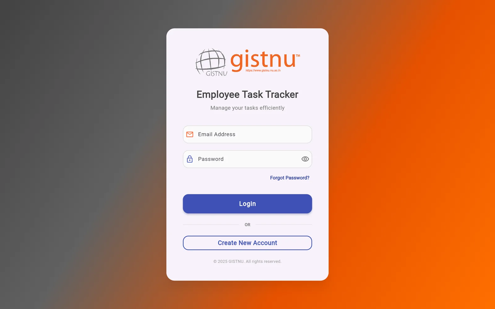
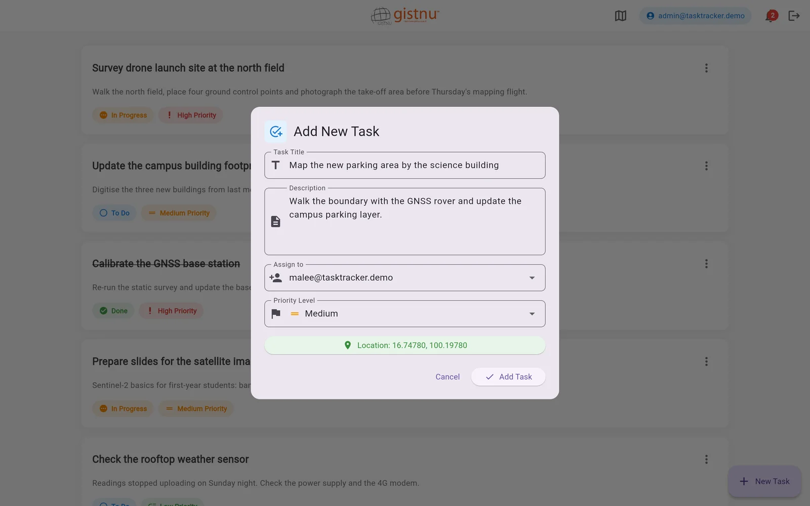
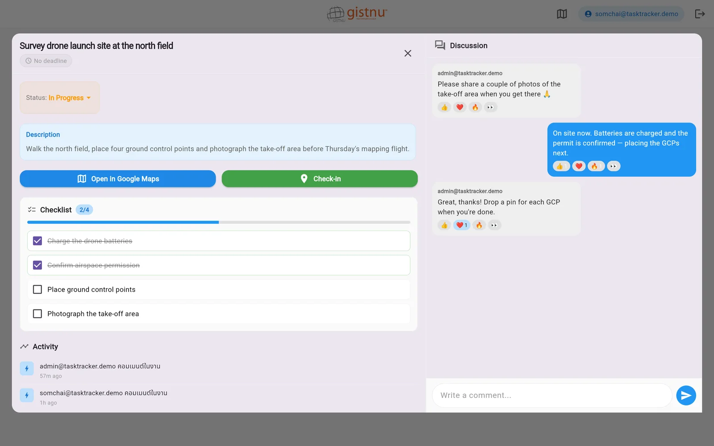
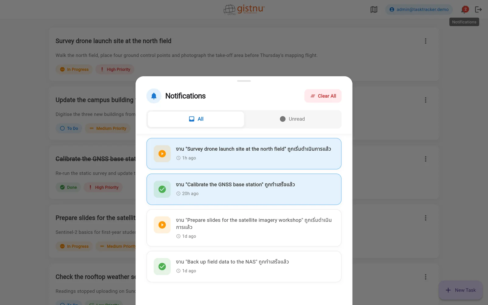
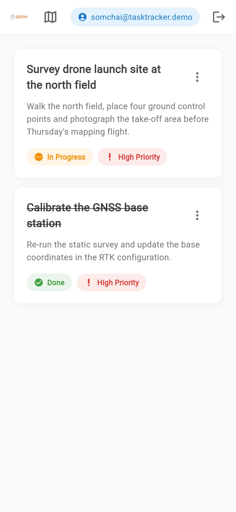
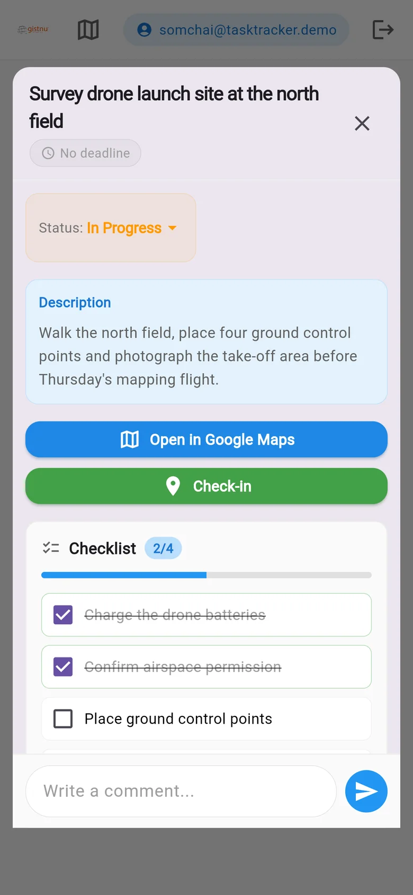

<p align="center">
  
</p>

<h1 align="center">Employee Task Tracker</h1>

<p align="center">
  <strong>A Flutter mini-project for learning & practicing mobile development fundamentals</strong>
</p>

<p align="center">
  <a href="https://putianan65.github.io/employee_task_tracker/?lang=en"><strong>Live showcase</strong></a>
  ·
  <a href="README_TH.md">อ่านภาษาไทย (TH)</a>
</p>

<p align="center">
  
  
  
  
</p>

<p align="center">
  <a href="https://putianan65.github.io/employee_task_tracker/?lang=en">
    
  </a>
</p>

---

## About This Project

**Employee Task Tracker** is a mini-project I built **while waiting for the official project requirements** to be finalized. The goal was to **practice and deepen my understanding of Flutter development fundamentals** — from state management and Firebase integration to role-based access control and real-time data synchronization.

> **Note:** This is **not** a production application. It is a personal learning project created to explore Flutter concepts hands-on.

---

## The Problem It Solves

When a small team hands out work through group chats and spreadsheets:

- **Assignments get buried** — nobody is sure who owns which task.
- **Status is guesswork** — admins keep chasing people for updates.
- **Field work has no location** — it's unclear where a job actually is.

Employee Task Tracker puts every task, its owner, its status and its location into **one real-time list**:

| Question | How the app answers it |
|---|---|
| **Who is on it?** | Admins assign each task to a person; employees only see the work assigned to them. |
| **Is it done yet?** | Status syncs in real time and notifies the admin the moment it changes. |
| **Where is the job?** | Tasks carry GPS pins and show up on Google Maps around the GIST NU campus. |

---

## How It Works

> Every screenshot below is a **real screen** from the app, running on Flutter Web against the Firebase Emulator with demo data.

### 1. Sign in — *everyone*

Log in with email and password through Firebase Auth, create an account, or request a password-reset link. Each account carries a role (`admin` or `employee`) stored in Firestore.



### 2. Assign the work — *admin*

Create a task with a title, description, assignee, priority and an optional GPS location. It shows up in the assigned employee's task list immediately.



### 3. Do the work — *employee*

Employees only see their own tasks. Open one to tick off the checklist, talk it through in the task chat (with emoji reactions), and move it from **To Do → In Progress → Done**.



### 4. Track progress — *admin*

Every status change shows up in the admin's notification inbox in real time, with an unread badge — no more chasing people for updates.



### On a phone

The same Flutter code adapts to small screens — the task detail switches from a side-by-side layout to a single column.

<p>
  
  &nbsp;
  
</p>

---

## Key Features

| Feature | Description |
|---|---|
| **Authentication** | Email/password login & registration via Firebase Auth, including password reset |
| **Role-Based Access** | Two roles — **Admin** (full access) and **Employee** (sees only assigned tasks) |
| **Task Management** | Create, edit, update status, assign, and delete tasks (CRUD) |
| **Task Status Tracking** | Three statuses — `To Do` → `In Progress` → `Done` |
| **Real-Time Sync** | Firestore streams for instant data updates across devices |
| **In-App Notifications** | Notify task creators/admins when status changes occur |
| **Task Chat & Comments** | Message thread per task with emoji reactions and file attachments |
| **Checklist** | Sub-task checklist within each task for detailed progress tracking |
| **Map View** | Google Maps integration to visualize task locations (GIST NU campus) |
| **Activity Log** | Track all actions performed on each task |
| **Responsive Layout** | Task detail adapts: side-by-side on desktop, tabs on tablet, single column on mobile |

---

## Tech Stack

| Layer | Technology |
|---|---|
| **Framework** | Flutter (Dart) — SDK ^3.7.2 |
| **Authentication** | Firebase Auth |
| **Database** | Cloud Firestore (real-time NoSQL) |
| **Maps** | Google Maps Flutter |
| **Location** | Geolocator |
| **Utilities** | intl (date formatting), url_launcher |
| **Architecture** | Service-based pattern with models, services, screens, and widgets |

---

## Project Structure

```
lib/
├── main.dart                  # App entry point & route config
├── firebase_options.dart      # Firebase configuration (auto-generated, not committed)
│
├── auth/
│   └── auth_service.dart      # Login, register, logout, password reset
│
├── models/
│   ├── task.dart              # Task data model
│   ├── user_model.dart        # User model with role (admin/employee)
│   ├── task_message.dart      # Chat messages & attachments model
│   ├── task_location.dart     # Location data model
│   ├── checklist_item.dart    # Checklist sub-items model
│   ├── activity_log.dart      # Activity log model
│   └── notification_model.dart # Notification model
│
├── services/
│   ├── task_service.dart      # CRUD operations & role-based queries
│   ├── task_detail_service.dart # Task detail operations (chat, checklist, etc.)
│   ├── notification_service.dart # In-app notification logic
│   └── location_service.dart  # GPS & location utilities
│
├── screens/
│   ├── auth/
│   │   ├── login_screen.dart      # Login page
│   │   └── register_screen.dart   # Registration page
│   ├── task_list_screen.dart      # Main task list (filtered by role)
│   ├── task_form_screen.dart      # Create/edit task form (placeholder — empty)
│   ├── task_detail_dialog.dart    # Task detail with chat & checklist
│   └── task_map_screen.dart       # Google Maps task view
│
├── widgets/
│   ├── task_card.dart         # Task list item card (placeholder — empty)
│   └── status_chip.dart       # Status badge widget (placeholder — empty)
│
├── theme/
│   └── app_theme.dart         # App-wide theme (placeholder — empty)
│
└── utils/
    └── date_formatter.dart    # Date/time formatting helpers (placeholder — empty)

showcase/                      # Portfolio landing page (React + Vite + Tailwind)
```

---

## What I Learned

Through building this project, I practiced the following Flutter & Firebase concepts:

- **Firebase Integration** — Auth, Firestore setup, and real-time streams
- **State Management** — Using `StreamBuilder` for reactive UI updates
- **Role-Based Access Control** — Filtering data and UI based on user roles
- **CRUD Operations** — Full create, read, update, delete flow with Firestore
- **Google Maps Integration** — Displaying map markers with task locations
- **Clean Code Structure** — Separating concerns into models, services, screens, and widgets
- **Material Design** — Building consistent, themed UI components

---

## Getting Started

### Prerequisites

- Flutter SDK ^3.7.2
- Dart SDK
- Firebase project (Auth + Firestore enabled)
- Google Maps API key (for map features)

### Installation

```bash
# Clone the repository
git clone https://github.com/putianan65/employee_task_tracker.git

# Navigate to the project
cd employee_task_tracker

# Install dependencies
flutter pub get

# Run the app
flutter run
```

> You will need to configure your own Firebase project and update `firebase_options.dart` accordingly.

---

## Showcase Page

The [`showcase/`](showcase) folder contains a portfolio landing page for this project — Thai by default, with an English toggle — built with React, TypeScript, Vite, Tailwind CSS and lucide-react. It is deployed to GitHub Pages by [`.github/workflows/deploy-showcase.yml`](.github/workflows/deploy-showcase.yml) on every push to `main` that touches `showcase/`.

```bash
cd showcase
npm install
npm run dev      # local preview
npm run build    # production build in showcase/dist
```

To publish it, open **Settings → Pages** in this repository and set **Source** to **GitHub Actions**.

---

## Credits

- **Showcase design** — layout, scroll-scrubbed video, motion and glass styling are adapted from the **“NovaAI — Today AI Aligns With Bold Dreams”** landing page (exact-recreation prompt). All design credit goes to its original creator.
- **Hero video** — abstract 3D render streamed from the original NovaAI CDN. © its original creator; it is not redistributed in this repository.
- **Typefaces** — [Inter](https://rsms.me/inter/) by Rasmus Andersson and [IBM Plex Sans Thai](https://github.com/IBM/plex) by IBM, both SIL Open Font License, via Google Fonts.
- **Icons** — [Lucide](https://lucide.dev) (ISC License).
- **GIST NU logo** — belongs to GIST NU, Naresuan University.
- **Screenshots** — captured from this app with fictional demo accounts and tasks.

---

## License

This project is for **educational purposes only**. Feel free to reference it for learning.

---

<p align="center">
  Built with Flutter & Firebase
</p>
