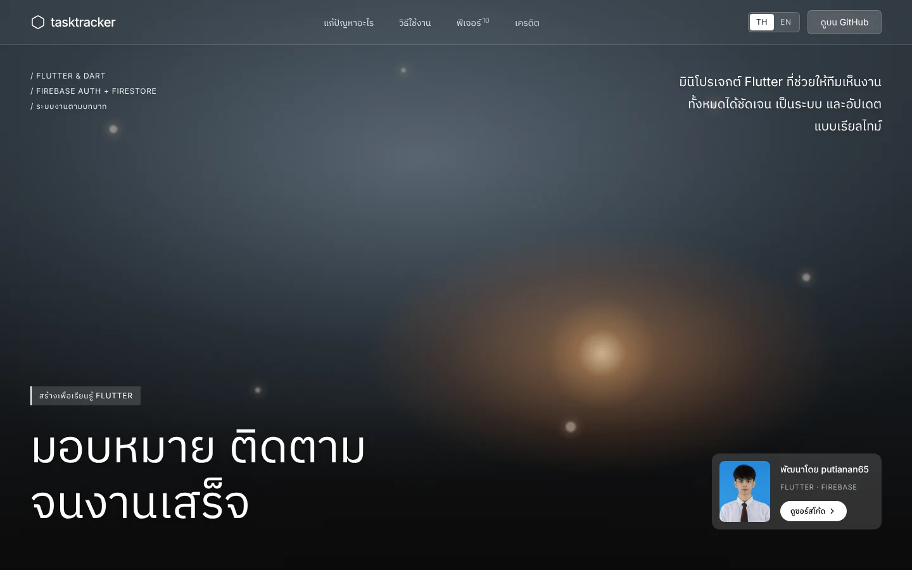

<p align="center">
  
</p>

<h1 align="center">Employee Task Tracker</h1>

<p align="center">
  <strong>มินิโปรเจกต์ Flutter สำหรับฝึกฝนและเรียนรู้การพัฒนาแอปพลิเคชันมือถือเบื้องต้น</strong>
</p>

<p align="center">
  <a href="https://putianan65.github.io/employee_task_tracker/"><strong>ดูหน้า Showcase</strong></a>
  ·
  <a href="README.md">Read in English (EN)</a>
</p>

<p align="center">
  
  
  
  
</p>

<p align="center">
  <a href="https://putianan65.github.io/employee_task_tracker/">
    
  </a>
</p>

---

## เกี่ยวกับโปรเจกต์นี้

**Employee Task Tracker** เป็นมินิโปรเจกต์ที่ผมจัดทำขึ้น **ระหว่างรอ Requirement ของโปรเจกต์จริง** โดยมีจุดประสงค์เพื่อ **ฝึกฝนและเรียนรู้พื้นฐานการพัฒนาแอปพลิเคชันด้วย Flutter** ตั้งแต่การจัดการ State, การเชื่อมต่อ Firebase, ระบบ Role-Based Access Control ไปจนถึงการ Sync ข้อมูลแบบ Real-Time

> **หมายเหตุ:** โปรเจกต์นี้ **ไม่ใช่** แอปพลิเคชันสำหรับใช้งานจริง (Production) เป็นโปรเจกต์ส่วนตัวที่สร้างขึ้นเพื่อเรียนรู้แนวคิดของ Flutter แบบลงมือทำ

---

## ปัญหาที่โปรเจกต์นี้แก้

เมื่อทีมเล็ก ๆ สั่งงานกันผ่านแชทกลุ่มหรือสเปรดชีต มักเจอปัญหาเหล่านี้:

- **งานจมหาย** — ไม่แน่ใจว่าใครรับผิดชอบงานไหน
- **ไม่รู้สถานะ** — แอดมินต้องคอยไล่ถามความคืบหน้าอยู่เสมอ
- **ไม่รู้ตำแหน่งงาน** — งานภาคสนามไม่มีข้อมูลว่าต้องไปทำที่ไหน

Employee Task Tracker รวมงาน ผู้รับผิดชอบ สถานะ และตำแหน่งของงานไว้ใน **รายการเดียวที่อัปเดตแบบเรียลไทม์**:

| คำถาม | แอปตอบอย่างไร |
|---|---|
| **ใครรับผิดชอบงานนี้?** | แอดมินมอบหมายงานให้แต่ละคน พนักงานจะเห็นเฉพาะงานที่ได้รับมอบหมายเท่านั้น |
| **งานเสร็จหรือยัง?** | สถานะงานซิงก์แบบเรียลไทม์ และแจ้งเตือนแอดมินทันทีที่มีการเปลี่ยนแปลง |
| **งานอยู่ตรงไหน?** | ปักหมุด GPS ให้แต่ละงานได้ และดูตำแหน่งบน Google Maps รอบพื้นที่ GIST NU |

---

## วิธีใช้งาน

> ภาพทั้งหมดด้านล่างเป็น **หน้าจอจริง** ของแอป รันบน Flutter Web กับ Firebase Emulator และข้อมูลตัวอย่าง

### 1. เข้าสู่ระบบ — *ทุกคน*

ล็อกอินด้วยอีเมลและรหัสผ่านผ่าน Firebase Auth สมัครสมาชิกใหม่ หรือขอลิงก์รีเซ็ตรหัสผ่านได้ ทุกบัญชีมีบทบาท (`admin` หรือ `employee`) เก็บไว้ใน Firestore


### 2. มอบหมายงาน — *แอดมิน*

สร้างงานพร้อมชื่อ รายละเอียด ผู้รับผิดชอบ ระดับความสำคัญ และตำแหน่ง GPS (ถ้ามี) งานจะขึ้นในรายการของพนักงานที่ได้รับมอบหมายทันที


### 3. ลงมือทำงาน — *พนักงาน*

พนักงานเห็นเฉพาะงานของตัวเอง เปิดงานเพื่อติ๊ก Checklist คุยกับทีมในแชทของงาน (รองรับ Emoji Reaction) แล้วเปลี่ยนสถานะจาก **To Do → In Progress → Done**


### 4. ติดตามความคืบหน้า — *แอดมิน*

ทุกการเปลี่ยนสถานะจะเข้ากล่องแจ้งเตือนของแอดมินแบบเรียลไทม์ พร้อมตัวเลขบอกจำนวนที่ยังไม่อ่าน — ไม่ต้องไล่ถามความคืบหน้าอีกต่อไป


### บนมือถือ

โค้ด Flutter ชุดเดียวกันปรับตามขนาดหน้าจอ — หน้ารายละเอียดงานเปลี่ยนจากแบบสองคอลัมน์เป็นคอลัมน์เดียว

<p>
  
  &nbsp;
  
</p>

---

## ฟีเจอร์หลัก

| ฟีเจอร์ | รายละเอียด |
|---|---|
| **ระบบยืนยันตัวตน** | เข้าสู่ระบบ & สมัครสมาชิกด้วย Email/Password ผ่าน Firebase Auth รองรับการรีเซ็ตรหัสผ่าน |
| **ระบบแบ่งสิทธิ์ตามบทบาท** | แบ่งเป็น 2 บทบาท — **Admin** (เห็นงานทั้งหมด) และ **Employee** (เห็นเฉพาะงานที่ถูกมอบหมาย) |
| **จัดการงาน (Task Management)** | สร้าง, แก้ไข, อัปเดตสถานะ, มอบหมาย และลบงาน (CRUD) |
| **ติดตามสถานะงาน** | 3 สถานะ — `To Do` → `In Progress` → `Done` |
| **อัปเดตข้อมูลแบบ Real-Time** | ใช้ Firestore Streams ให้ข้อมูลอัปเดตทันทีข้ามอุปกรณ์ |
| **แจ้งเตือนในแอป** | แจ้งเตือนผู้สร้างงาน/Admin เมื่อมีการเปลี่ยนแปลงสถานะ |
| **แชทและคอมเมนต์ในงาน** | ระบบข้อความในแต่ละงาน รองรับ Emoji Reactions และแนบไฟล์ |
| **Checklist** | รายการย่อยภายในแต่ละงาน สำหรับติดตามความคืบหน้าอย่างละเอียด |
| **แผนที่แสดงตำแหน่งงาน** | เชื่อมต่อ Google Maps เพื่อแสดงตำแหน่งงานบนแผนที่ (บริเวณ GIST NU) |
| **บันทึกกิจกรรม (Activity Log)** | บันทึกทุกการกระทำที่เกิดขึ้นกับแต่ละงาน |
| **รองรับหลายขนาดหน้าจอ** | หน้ารายละเอียดงานแสดงแบบสองคอลัมน์บนเดสก์ท็อป แบบแท็บบนแท็บเล็ต และคอลัมน์เดียวบนมือถือ |

---

## เทคโนโลยีที่ใช้

| ส่วนประกอบ | เทคโนโลยี |
|---|---|
| **Framework** | Flutter (Dart) — SDK ^3.7.2 |
| **ระบบยืนยันตัวตน** | Firebase Auth |
| **ฐานข้อมูล** | Cloud Firestore (NoSQL แบบ Real-Time) |
| **แผนที่** | Google Maps Flutter |
| **ตำแหน่ง GPS** | Geolocator |
| **เครื่องมือเสริม** | intl (จัดรูปแบบวันที่), url_launcher |
| **สถาปัตยกรรม** | Service-based Pattern แยกเป็น Models, Services, Screens และ Widgets |

---

## โครงสร้างโปรเจกต์

```
lib/
├── main.dart                  # จุดเริ่มต้นของแอป & ตั้งค่า Route
├── firebase_options.dart      # ค่า Config ของ Firebase (สร้างอัตโนมัติ, ไม่ได้ commit)
│
├── auth/
│   └── auth_service.dart      # เข้าสู่ระบบ, สมัครสมาชิก, ออกจากระบบ, รีเซ็ตรหัสผ่าน
│
├── models/
│   ├── task.dart              # โมเดลข้อมูลงาน
│   ├── user_model.dart        # โมเดลผู้ใช้พร้อมบทบาท (admin/employee)
│   ├── task_message.dart      # โมเดลข้อความแชทและไฟล์แนบ
│   ├── task_location.dart     # โมเดลข้อมูลตำแหน่ง
│   ├── checklist_item.dart    # โมเดลรายการ Checklist ย่อย
│   ├── activity_log.dart      # โมเดลบันทึกกิจกรรม
│   └── notification_model.dart # โมเดลการแจ้งเตือน
│
├── services/
│   ├── task_service.dart      # CRUD & Query งานตามบทบาท
│   ├── task_detail_service.dart # รายละเอียดงาน (แชท, Checklist ฯลฯ)
│   ├── notification_service.dart # ระบบแจ้งเตือนในแอป
│   └── location_service.dart  # เครื่องมือ GPS & ตำแหน่ง
│
├── screens/
│   ├── auth/
│   │   ├── login_screen.dart      # หน้าเข้าสู่ระบบ
│   │   └── register_screen.dart   # หน้าสมัครสมาชิก
│   ├── task_list_screen.dart      # หน้ารายการงานหลัก (กรองตามบทบาท)
│   ├── task_form_screen.dart      # ฟอร์มสร้าง/แก้ไขงาน (ไฟล์เตรียมไว้ — ยังว่าง)
│   ├── task_detail_dialog.dart    # รายละเอียดงานพร้อมแชท & Checklist
│   └── task_map_screen.dart       # หน้าแผนที่แสดงตำแหน่งงาน
│
├── widgets/
│   ├── task_card.dart         # Card แสดงรายการงาน (ไฟล์เตรียมไว้ — ยังว่าง)
│   └── status_chip.dart       # Badge แสดงสถานะงาน (ไฟล์เตรียมไว้ — ยังว่าง)
│
├── theme/
│   └── app_theme.dart         # ธีมหลักของแอป (ไฟล์เตรียมไว้ — ยังว่าง)
│
└── utils/
    └── date_formatter.dart    # ฟังก์ชันจัดรูปแบบวันที่/เวลา (ไฟล์เตรียมไว้ — ยังว่าง)

showcase/                      # หน้า Portfolio ของโปรเจกต์ (React + Vite + Tailwind)
```

---

## สิ่งที่ได้เรียนรู้

จากการสร้างโปรเจกต์นี้ ผมได้ฝึกฝนแนวคิดของ Flutter & Firebase ดังนี้:

- **การเชื่อมต่อ Firebase** — ตั้งค่า Auth, Firestore และใช้งาน Real-Time Streams
- **การจัดการ State** — ใช้ `StreamBuilder` สำหรับ UI ที่อัปเดตแบบ Reactive
- **ระบบสิทธิ์ตามบทบาท (Role-Based Access Control)** — กรองข้อมูลและ UI ตามบทบาทผู้ใช้
- **CRUD Operations** — ขั้นตอนการสร้าง อ่าน อัปเดต ลบข้อมูลกับ Firestore ครบวงจร
- **การเชื่อมต่อ Google Maps** — แสดง Marker ตำแหน่งงานบนแผนที่
- **โครงสร้างโค้ดที่เป็นระเบียบ** — แยก Concern ออกเป็น Models, Services, Screens และ Widgets
- **Material Design** — สร้าง UI Component ที่มีธีมสอดคล้องกันทั้งแอป

---

## เริ่มต้นใช้งาน

### สิ่งที่ต้องมี

- Flutter SDK ^3.7.2
- Dart SDK
- Firebase Project (เปิดใช้ Auth + Firestore)
- Google Maps API Key (สำหรับฟีเจอร์แผนที่)

### วิธีติดตั้ง

```bash
# Clone repository
git clone https://github.com/putianan65/employee_task_tracker.git

# เข้าไปในโปรเจกต์
cd employee_task_tracker

# ติดตั้ง dependencies
flutter pub get

# รันแอป
flutter run
```

> คุณจะต้องตั้งค่า Firebase Project ของคุณเอง และอัปเดตไฟล์ `firebase_options.dart` ให้ตรงกับ Project ของคุณ

---

## หน้า Showcase

โฟลเดอร์ [`showcase/`](showcase) คือหน้า Portfolio ของโปรเจกต์นี้ — แสดงภาษาไทยเป็นค่าเริ่มต้น และสลับเป็นภาษาอังกฤษได้ สร้างด้วย React, TypeScript, Vite, Tailwind CSS และ lucide-react โดย [`.github/workflows/deploy-showcase.yml`](.github/workflows/deploy-showcase.yml) จะ deploy ขึ้น GitHub Pages ให้อัตโนมัติทุกครั้งที่ push เข้า `main` และมีการแก้ไขใน `showcase/`

```bash
cd showcase
npm install
npm run dev      # เปิดดูบนเครื่อง
npm run build    # build สำหรับ production ไว้ที่ showcase/dist
```

วิธีเปิดใช้งาน: ไปที่ **Settings → Pages** ของ Repository นี้ แล้วตั้ง **Source** เป็น **GitHub Actions**

---

## เครดิต

- **ดีไซน์หน้า Showcase** — เลย์เอาต์ วิดีโอที่เลื่อนตามการ scroll โมชัน และสไตล์กระจกฝ้า ดัดแปลงมาจากแลนดิ้งเพจ **“NovaAI — Today AI Aligns With Bold Dreams”** (Exact-recreation prompt) เครดิตการออกแบบทั้งหมดเป็นของผู้สร้างต้นฉบับ
- **วิดีโอพื้นหลัง** — ภาพเรนเดอร์ 3D สตรีมจาก CDN ของต้นฉบับ NovaAI © ผู้สร้างต้นฉบับ ไม่ได้นำไฟล์มาเผยแพร่ซ้ำใน Repository นี้
- **ฟอนต์** — [Inter](https://rsms.me/inter/) โดย Rasmus Andersson และ [IBM Plex Sans Thai](https://github.com/IBM/plex) โดย IBM ใช้สัญญาอนุญาต SIL Open Font License ผ่าน Google Fonts
- **ไอคอน** — [Lucide](https://lucide.dev) (ISC License)
- **โลโก้ GIST NU** — เป็นของ GIST NU มหาวิทยาลัยนเรศวร
- **ภาพหน้าจอ** — ถ่ายจากแอปนี้โดยใช้บัญชีและข้อมูลงานตัวอย่างที่สมมติขึ้น

---

## สัญญาอนุญาต

โปรเจกต์นี้จัดทำขึ้นเพื่อ **วัตถุประสงค์ทางการศึกษาเท่านั้น** สามารถนำไปอ้างอิงเพื่อเรียนรู้ได้ตามสะดวก

---

<p align="center">
  สร้างด้วย Flutter & Firebase
</p>
